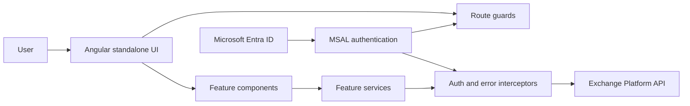

<div align="center">
  

  # Exchange Platform Frontend

  **Frontend technical challenge developed as part of a selection process for Banco de Crédito del Perú (BCP).**

  [](https://github.com/mbarretot/bcp-exchange-platform-frontend/actions/workflows/ci.yml)
  
  
  
</div>

> [!IMPORTANT]
> This is an independent portfolio project created for a technical challenge. It is not an official BCP product, is not maintained by BCP, and contains no production data or credentials.

## What this project demonstrates

This application provides a responsive interface for managing exchange rates and hierarchical business parameters. It combines Angular standalone components, feature-oriented organization, Microsoft Entra ID authentication through MSAL, role-aware UI behavior, server-side rendering, and automated Azure Static Web Apps delivery.

### Main capabilities

- Authenticate users with Microsoft Entra ID using popup or redirect flows.
- Browse, filter, paginate, create, update, and soft-delete exchange rates.
- Maintain reusable parameters such as supported currencies.
- Restrict editing controls according to token roles.
- Attach access tokens and Azure Functions keys through the HTTP layer.
- Provide loading states, notifications, validation, and centralized API error handling.
- Provision and deploy an Azure Static Web App with Terraform and GitHub Actions.

## Architecture



| Area | Responsibility |
| --- | --- |
| `core/` | Authentication configuration, guards, interceptors, models, and singleton services |
| `features/` | Exchange-rate, parameter, configuration, and welcome experiences |
| `pages/` | Route-level pages such as login |
| `shared/` | Reusable navigation, spinner components, and UI services |
| `environments/` | API and Microsoft Entra ID configuration |
| `terraform/` | Azure Static Web Apps infrastructure |

Routes and feature components are lazy-loaded. Browser-specific authentication code is guarded so the application remains compatible with Angular SSR.

## Technology stack

- Angular 19 with standalone components
- TypeScript 5.7 and RxJS 7
- PrimeNG 19 and PrimeIcons
- Tailwind CSS 4 with PrimeUI integration
- MSAL Angular and MSAL Browser
- Angular SSR with Express
- ESLint, Prettier, Husky, lint-staged, and Commitlint
- Terraform and Azure Static Web Apps

## Quick start

### Prerequisites

- Node.js 20
- npm
- A running [Exchange Platform backend](https://github.com/mbarretot/bcp-exchange-platform-backend)
- A Microsoft Entra ID application registration for authenticated flows

### 1. Install dependencies

```bash
npm ci
```

### 2. Configure the application

Update `src/environments/environment.development.ts` with values for your environment:

```typescript
export const environment = {
  production: false,
  apiUrl: 'http://localhost:7071/api',
  functionKey: '',
  version: '1.0.0-dev',
  msalConfig: {
    auth: {
      clientId: '<application-client-id>',
      authority: 'https://login.microsoftonline.com/<tenant-id>',
      redirectUri: 'http://localhost:4200'
    }
  },
  apiConfig: {
    scopes: ['api://<backend-client-id>/access_as_user'],
    uri: 'http://localhost:7071/api'
  }
};
```

Register `http://localhost:4200` as a Single-page application redirect URI in Microsoft Entra ID.

> [!WARNING]
> Angular environment values are shipped to the browser. Never place secrets in them. An Azure Functions key embedded in this frontend must be treated as public client configuration, not as a security boundary.

### 3. Run locally

```bash
npm start
```

Open `http://localhost:4200`. The backend allows this origin in its current local CORS configuration.

### 4. Verify the project

```bash
npm run lint
npm run format:check
npm run build
npm test
```

## Application routes

| Route | Purpose | Authentication |
| --- | --- | --- |
| `/login` | Microsoft Entra ID sign-in | Public |
| `/welcome` | Authenticated landing page | Required |
| `/exchange-rates` | Exchange-rate management | Required |
| `/parameters` | Parameter management | Required |
| `/configuration` | Configuration area | Required |
| `/dashboard` | Redirect to the welcome page | Required after redirect |

The current UI considers users with the `Viewer` role read-only. The backend remains the authoritative enforcement point for write permissions.

## Available commands

| Command | Purpose |
| --- | --- |
| `npm start` | Start the Angular development server |
| `npm run build` | Create the production and SSR bundles |
| `npm run watch` | Rebuild continuously with development settings |
| `npm run lint` | Run ESLint |
| `npm run lint:fix` | Apply supported ESLint fixes |
| `npm run format` | Format application sources with Prettier |
| `npm run format:check` | Check formatting without changing files |
| `npm test` | Run the Karma/Jasmine test runner |
| `npm run serve:ssr:bcp-exchange-app` | Serve an existing SSR build |

## Delivery pipeline

Pull requests to `main` or `develop` run linting and a production build. A push to `main` provisions the Azure Static Web App with Terraform and deploys the browser bundle through GitHub Actions.

Required GitHub secrets include the Azure service-principal credentials used by Terraform and `AZURE_STATIC_WEB_APPS_API_TOKEN` for deployment. Terraform state is configured for the `rg-bcp-exchange` Azure resource group and its remote storage backend.

## Production readiness

This repository represents a bounded technical challenge, not a production banking application. Before production use, externalize environment configuration, avoid distributing privileged Function keys, complete automated component and end-to-end coverage, review role semantics, add accessibility validation, and enforce security headers and operational monitoring.

See [SECURITY.md](SECURITY.md) for the repository's security guidance and [NOTICE.md](NOTICE.md) for trademark and project-status information.
